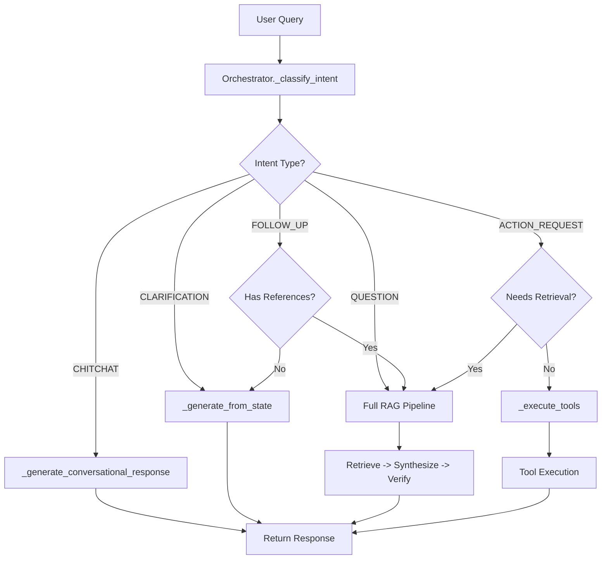

# Agentic Pipeline Intent Classification

## Problem Statement

The agentic pipeline always runs retrieval for every query, including simple greetings like "hi". When no documents are found, it returns a hardcoded message: "I don't have specific information in the documents..."

The optimized pipeline already has intent classification that skips retrieval for chitchat - we need to integrate this into the agentic pipeline.

## Architecture



## Implementation Plan

### 1. Update AgentState to Include Intent

**File:** [backend/app/agents/state.py](backend/app/agents/state.py)

Add intent tracking to `AgentState`:

```python
from app.services.query_processor import Intent, QueryResult

@dataclass
class AgentState:
    # ... existing fields ...
    
    # Intent classification
    intent: Optional[Intent] = None
    intent_confidence: float = 0.0
    needs_retrieval: bool = True
    resolved_references: List[str] = field(default_factory=list)
```

### 2. Add Intent Classification to Orchestrator

**File:** [backend/app/agents/orchestrator.py](backend/app/agents/orchestrator.py)

Add a new method `_classify_intent()` that reuses `QueryProcessor`:

```python
from app.services.query_processor import QueryProcessor, Intent, QueryResult

class OrchestratorAgent(BaseAgent):
    def __init__(self, ...):
        # ... existing init ...
        self._query_processor = QueryProcessor()
    
    async def _classify_intent(self, state: AgentState) -> AgentState:
        """Classify query intent before processing."""
        query_result = await self._query_processor.process(
            message=state.query,
            state=state.conversation_state,  # Pass conversation state for reference resolution
        )
        
        state.intent = query_result.intent
        state.intent_confidence = query_result.confidence
        state.needs_retrieval = query_result.needs_retrieval
        state.resolved_references = query_result.resolved_references
        
        # Update search query if rewritten
        if query_result.search_query != query_result.original_query:
            state.search_query = query_result.search_query
        
        return state
```

### 3. Add Intent-Based Response Generators

**File:** [backend/app/agents/orchestrator.py](backend/app/agents/orchestrator.py)

Add response generators for non-RAG intents:

```python
CONVERSATIONAL_RESPONSES = {
    "greeting": [
        "Hello! How can I help you today?",
        "Hi there! What would you like to know?",
        "Hey! I'm here to help. What can I assist you with?",
    ],
    "thanks": [
        "You're welcome! Let me know if you need anything else.",
        "Happy to help! Is there anything else you'd like to know?",
    ],
    "farewell": [
        "Goodbye! Feel free to come back anytime.",
        "Take care! I'm here if you need more help.",
    ],
    "acknowledgment": [
        "Got it! What would you like to do next?",
        "Understood. How can I help you further?",
    ],
    "help": [
        "I can help you search through documents, answer questions about your data, "
        "perform calculations, and assist with date/time queries. What would you like to do?",
    ],
}

async def _generate_conversational_response(self, state: AgentState) -> str:
    """Generate response for chitchat without retrieval."""
    query_lower = state.query.lower().strip()
    
    # Detect greeting type
    if re.match(r"^(hi|hello|hey|howdy|greetings|yo)[\s!?.]*$", query_lower, re.I):
        responses = CONVERSATIONAL_RESPONSES["greeting"]
    elif re.match(r"^(thanks|thank you|thx|ty|appreciate).*$", query_lower, re.I):
        responses = CONVERSATIONAL_RESPONSES["thanks"]
    elif re.match(r"^(bye|goodbye|see you|later|farewell).*$", query_lower, re.I):
        responses = CONVERSATIONAL_RESPONSES["farewell"]
    elif re.match(r"^(yes|no|ok|okay|sure|alright|got it)[\s!?.]*$", query_lower, re.I):
        responses = CONVERSATIONAL_RESPONSES["acknowledgment"]
    elif re.match(r"^(help|what can you do|who are you).*$", query_lower, re.I):
        responses = CONVERSATIONAL_RESPONSES["help"]
    else:
        # Generic conversational response
        responses = ["I'm here to help! What would you like to know about the documents?"]
    
    import random
    return random.choice(responses)

async def _generate_from_state(self, state: AgentState) -> str:
    """Generate response using only conversation state (no new retrieval)."""
    if not state.conversation_state or not state.conversation_state.running_summary:
        return "I don't have enough context from our conversation. Could you provide more details?"
    
    # Use synthesis agent with state context only
    prompt = f"""Based on our conversation so far:
{state.conversation_state.running_summary}

The user asked: {state.query}

Provide a helpful response based on the conversation context. If you don't have enough information, say so clearly."""

    response = await self._call_llm(prompt, temperature=0.7)
    return response if response else "Could you clarify what you're referring to?"
```

### 4. Update Orchestrator.run() with Intent Gating

**File:** [backend/app/agents/orchestrator.py](backend/app/agents/orchestrator.py)

Modify the `run()` method to check intent before processing:

```python
async def run(self, state: AgentState) -> AgentState:
    """Execute the orchestration flow with intent gating."""
    start_time = time.time()
    correlation_id = state.metadata.get("correlation_id", "unknown")
    
    logger.info(
        f"[orchestrator] Starting orchestration for: {state.query[:50]}...",
        extra={"correlation_id": correlation_id}
    )
    
    try:
        # Step 0: Classify intent FIRST
        state = await self._classify_intent(state)
        
        logger.info(
            f"[orchestrator] Intent: {state.intent.value}, confidence: {state.intent_confidence:.2f}, "
            f"needs_retrieval: {state.needs_retrieval}",
            extra={"correlation_id": correlation_id}
        )
        
        # Step 0.5: Intent-based early exit
        if state.intent == Intent.CHITCHAT:
            state.final_answer = await self._generate_conversational_response(state)
            state.metadata["skipped_retrieval"] = True
            state.metadata["intent_gated"] = True
            return state
        
        if state.intent == Intent.CLARIFICATION:
            state.final_answer = await self._generate_from_state(state)
            state.metadata["skipped_retrieval"] = True
            state.metadata["intent_gated"] = True
            return state
        
        if state.intent == Intent.FOLLOW_UP and not state.resolved_references:
            # Follow-up with no resolvable references - use state only
            state.final_answer = await self._generate_from_state(state)
            state.metadata["skipped_retrieval"] = True
            state.metadata["intent_gated"] = True
            return state
        
        # Continue with normal RAG pipeline for QUESTION, ACTION_REQUEST, or FOLLOW_UP with refs
        # Step 1: Create plan
        state = await self._plan(state)
        
        # ... rest of existing flow ...
```

### 5. Update SynthesisAgent Fallback

**File:** [backend/app/agents/synthesis_agent.py](backend/app/agents/synthesis_agent.py)

Improve the no-context response to be more helpful:

```python
def _generate_no_context_response(self, state: AgentState) -> str:
    """Generate response when no context is available."""
    # Check if this should have been gated earlier
    if state.intent == Intent.CHITCHAT:
        return "Hello! How can I help you today?"
    
    # Check if tools were used but no documents
    if state.tool_results:
        # Tools were executed - respond based on tool results
        tool_summary = "\n".join([
            f"- {r.tool_name}: {r.result}" 
            for r in state.tool_results if r.success
        ])
        if tool_summary:
            return f"Here's what I found:\n{tool_summary}"
    
    # Actual no-context situation
    return (
        "I couldn't find relevant information in the documents for your question. "
        "This could mean:\n"
        "- The documents don't contain information about this topic\n"
        "- You might want to rephrase your question\n"
        "- The relevant documents may not have been uploaded yet\n\n"
        "Would you like to try a different question, or can I help with something else?"
    )
```

### 6. Handle Tool-Only Queries

**File:** [backend/app/agents/orchestrator.py](backend/app/agents/orchestrator.py)

For queries that only need tools (calculations, dates):

```python
async def run(self, state: AgentState) -> AgentState:
    # ... after intent classification ...
    
    # Check if this is a tool-only query (no document retrieval needed)
    if self._is_tool_only_query(state):
        state = await self._execute_tools(state)
        if state.tool_results:
            # Format tool results as final answer
            state.final_answer = self._format_tool_results(state)
            state.metadata["tool_only"] = True
            return state
    
    # Continue with RAG pipeline...

def _is_tool_only_query(self, state: AgentState) -> bool:
    """Check if query only needs tools, not document retrieval."""
    query_lower = state.query.lower()
    
    # Calculation patterns
    calc_patterns = [
        r"\b(calculate|compute|what is|how much is)\s+[\d\+\-\*\/\(\)\.\s]+",
        r"\b\d+\s*[\+\-\*\/]\s*\d+",
        r"\b(add|subtract|multiply|divide)\s+\d+",
    ]
    
    # Date/time patterns
    date_patterns = [
        r"\b(what|current|today'?s?)\s+(date|time|day|month|year)\b",
        r"\b(days?|weeks?|months?|years?)\s+(between|from|until|since)\b",
        r"\bhow (long|many days)\b",
    ]
    
    for pattern in calc_patterns + date_patterns:
        if re.search(pattern, query_lower, re.I):
            return True
    
    return False

def _format_tool_results(self, state: AgentState) -> str:
    """Format tool results into a readable response."""
    results = []
    for tr in state.tool_results:
        if tr.success:
            if tr.tool_name == "calculator":
                results.append(f"The result is: {tr.result}")
            elif tr.tool_name == "datetime":
                results.append(str(tr.result))
            else:
                results.append(f"{tr.tool_name}: {tr.result}")
    
    return "\n".join(results) if results else "I couldn't complete the calculation."
```

## Corner Cases to Handle

### Case 1: Ambiguous Queries

Queries like "that document" without prior context:

```python
if state.intent == Intent.FOLLOW_UP and not state.resolved_references:
    # Check if there's any conversation history
    if not state.conversation_state or not state.conversation_state.entities:
        state.final_answer = (
            "I'm not sure what you're referring to. Could you be more specific "
            "about which document or topic you'd like to know about?"
        )
        return state
```

### Case 2: Mixed Intent Queries

Queries like "Hi, what's the revenue for Q1?":

```python
def _has_question_component(self, query: str) -> bool:
    """Check if a chitchat query also contains a question."""
    # Remove greeting prefix
    query_stripped = re.sub(r"^(hi|hello|hey)[,!.]?\s*", "", query, flags=re.I)
    
    # Check if remainder looks like a question
    if len(query_stripped) > 10 and any(kw in query_stripped.lower() for kw in RETRIEVAL_KEYWORDS):
        return True
    return False

# In _classify_intent:
if state.intent == Intent.CHITCHAT and self._has_question_component(state.query):
    state.intent = Intent.QUESTION
    state.needs_retrieval = True
```

### Case 3: Negative/Rejection Responses

Queries like "no", "not that one", "wrong":

```python
REJECTION_PATTERNS = [
    r"^no[\s,!.]*$",
    r"^(not|nope|wrong|incorrect|that'?s? not)[\s\w]*$",
    r"^(try again|different|another)[\s\w]*$",
]

# Handle as clarification request
if state.intent == Intent.CHITCHAT and any(re.match(p, state.query, re.I) for p in REJECTION_PATTERNS):
    state.intent = Intent.CLARIFICATION
    state.final_answer = "I apologize for the confusion. Could you tell me what you're looking for?"
```

### Case 4: Empty State with Follow-up

```python
if state.intent == Intent.FOLLOW_UP:
    if not state.conversation_state:
        state.final_answer = "I don't have any context from previous messages. What would you like to know?"
        return state
    
    if state.resolved_references:
        # Has references - proceed with retrieval using resolved query
        state.search_query = state.resolved_references[0]  # Use resolved reference
    else:
        # No references resolved - ask for clarification
        state.final_answer = "Could you clarify what you're referring to? I want to make sure I understand your question."
        return state
```

### Case 5: Tool Query Without Enough Information

```python
# In _execute_tools:
if state.plan and state.plan.requires_tools:
    state = await self.tool_agent.run(state)
    
    # Check if tool failed due to missing parameters
    failed_tools = [r for r in state.tool_results if not r.success]
    if failed_tools:
        error_msgs = [r.error for r in failed_tools]
        state.final_answer = f"I need more information to help: {'; '.join(error_msgs)}"
        return state
```

## Files to Modify

| File | Changes |

|------|---------|

| [backend/app/agents/state.py](backend/app/agents/state.py) | Add intent fields to AgentState |

| [backend/app/agents/orchestrator.py](backend/app/agents/orchestrator.py) | Add intent classification, gating, and response generators |

| [backend/app/agents/synthesis_agent.py](backend/app/agents/synthesis_agent.py) | Improve no-context response |

| [backend/app/services/chat_service.py](backend/app/services/chat_service.py) | Pass conversation_state to AgentState |

## Testing Scenarios

1. **Greetings:** "hi", "hello", "hey there!" -> Friendly response
2. **Thanks:** "thank you", "thanks!" -> Acknowledgment
3. **Farewell:** "bye", "goodbye" -> Farewell response
4. **Help:** "what can you do?", "help" -> Capability explanation
5. **Pure calculation:** "what is 25 * 4?" -> Tool result only
6. **Date query:** "what's today's date?" -> DateTime tool
7. **Mixed greeting+question:** "Hi, what's the revenue?" -> RAG pipeline
8. **Follow-up with ref:** "tell me more about that" -> Resolve and retrieve
9. **Follow-up no ref:** "what about it?" (no prior context) -> Ask for clarification
10. **Rejection:** "no, not that one" -> Clarification request
11. **Ambiguous:** "that document" (no history) -> Ask for specifics
12. **Document question:** "What does the Q1 report say?" -> Full RAG pipeline