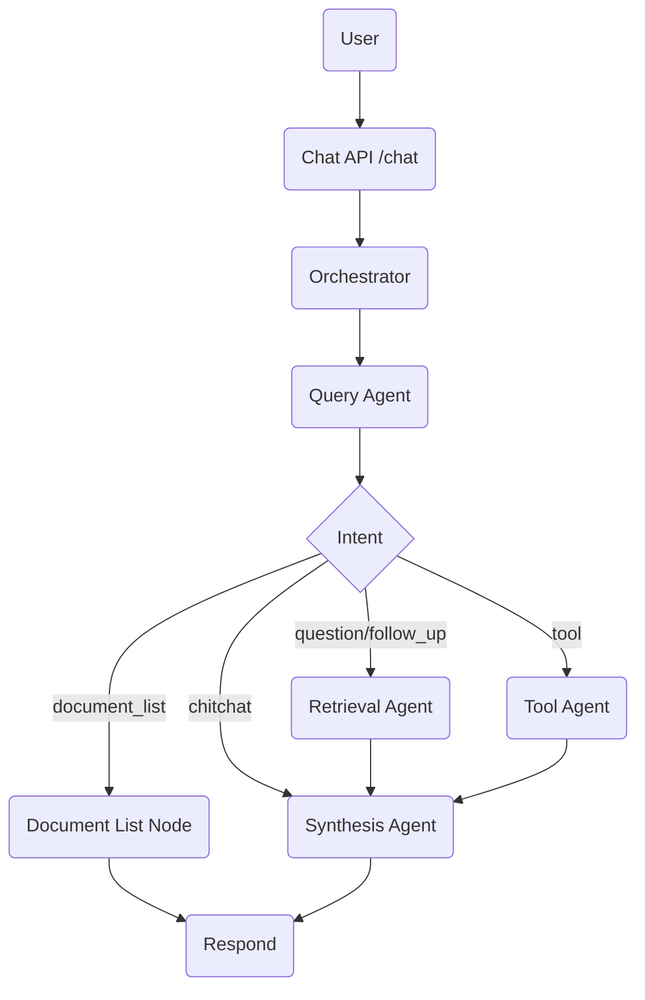

# Conversation & Agent Flow

## High-Level Flow

## Key Behaviors
- **Client isolation**: Every request must include `client_id`. Retrieval searches that client’s collection plus global.
- **Intent classification**: Done by LLM (no hardcoded patterns). Distinguishes:
  - `document_list`: user wants the list of documents (metadata)
  - `question`: user wants content from documents
  - `chitchat`, `follow_up`, `tool`
- **Routing**:
  - `document_list` → list node → respond directly
  - `question` / `follow_up` → retrieval → synthesis
  - `tool` → tool agent → synthesis
  - `chitchat` → synthesis
- **Synthesis**: Adds client context to the prompt, cites sources when available.

## Document Upload Path
1) `/documents/upload` (multipart)  
2) Extract text (Docling) → chunk → embed → store in Chroma (client + metadata)  
3) Available for retrieval immediately after the upload response

## Retrieval Details
- Vector search in client collection + global collection
- Reranking (if configured)
- Sources returned with metadata and passed to synthesis

## Error/Empty Handling
- If retrieval returns no chunks, synthesis replies that no documents were found for that client/context (no fallback retrieval).
