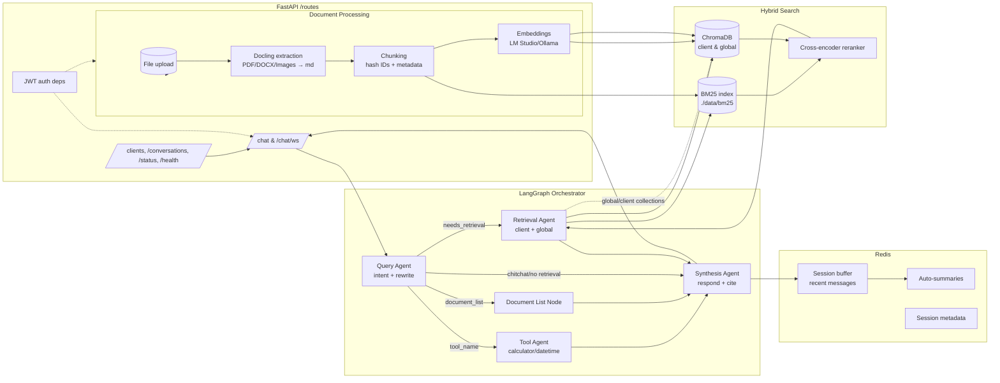
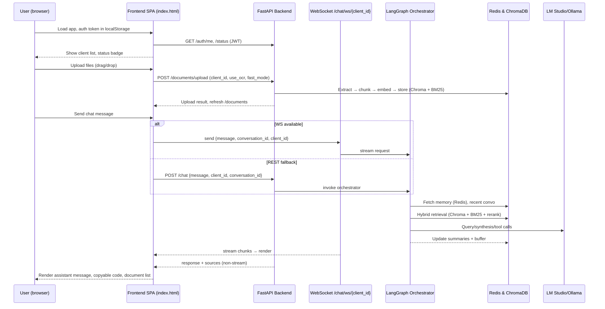
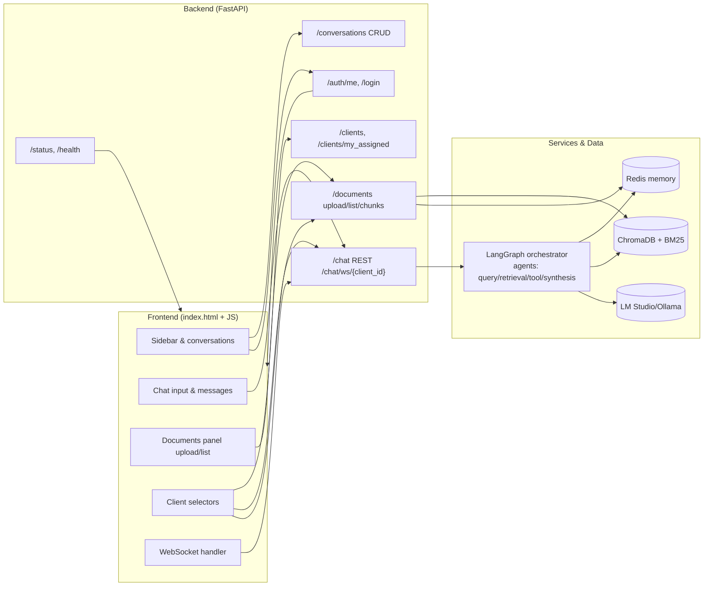

# System Diagrams

## Backend Components & Data Flow

```mermaid
flowchart LR
  subgraph API["FastAPI /routes"]
    Chat[/chat & /chat/ws/]
    Docs[/documents upload/list/]
    Clients[/clients, /conversations, /status, /health/]
    Auth[JWT auth deps]
  end

  subgraph Orchestrator["LangGraph Orchestrator"]
    QA[Query Agent<br/>intent + rewrite]
    TA[Tool Agent<br/>calculator/datetime]
    RA[Retrieval Agent<br/>client + global]
    SA[Synthesis Agent<br/>respond + cite]
    DL[Document List Node]
  end

  subgraph Memory["Redis"]
    Buffer[Session buffer<br/>recent messages]
    Summary[Auto-summaries]
    Meta[Session metadata]
  end

  subgraph Retrieval["Hybrid Search"]
    BM25[(BM25 index<br/>./data/bm25)]
    Vec[(ChromaDB<br/>client & global)]
    Rerank[Cross-encoder reranker]
  end

  subgraph Docs["Document Processing"]
    Upload[(File upload)]
    Docling[Docling extraction<br/>PDF/DOCX/Images → md]
    Chunk[Chunking<br/>hash IDs + metadata]
    Embed[Embeddings<br/>LM Studio/Ollama]
  end

  Chat --> QA
  Docs --> Upload
  Clients --> Chat
  Auth -.-> Chat
  Auth -.-> Docs

  QA -- tool_name --> TA --> SA
  QA -- document_list --> DL --> SA
  QA -- chitchat/no retrieval --> SA
  QA -- needs_retrieval --> RA

  RA --> BM25
  RA --> Vec
  BM25 --> Rerank
  Vec --> Rerank
  Rerank --> RA --> SA

  SA --> Chat
  SA --> Buffer
  Buffer --> Summary

  Upload --> Docling --> Chunk --> Embed --> Vec
  Chunk --> BM25
  Embed --> Vec
  Vec -.global/client collections.- RA
```

## Frontend ↔ Backend Interaction

```mermaid
sequenceDiagram
  participant U as User (browser)
  participant FE as Frontend SPA (index.html)
  participant API as FastAPI Backend
  participant WS as WebSocket /chat/ws/{client_id}
  participant Orch as LangGraph Orchestrator
  participant Stores as Redis & ChromaDB
  participant LLM as LM Studio/Ollama

  U->>FE: Load app, auth token in localStorage
  FE->>API: GET /auth/me, /status (JWT)
  FE-->>U: Show client list, status badge

  U->>FE: Upload files (drag/drop)
  FE->>API: POST /documents/upload (client_id, use_ocr, fast_mode)
  API->>Stores: Extract → chunk → embed → store (Chroma + BM25)
  API-->>FE: Upload result, refresh /documents

  U->>FE: Send chat message
  alt WS available
    FE->>WS: send {message, conversation_id, client_id}
    WS->>Orch: stream request
  else REST fallback
    FE->>API: POST /chat {message, client_id, conversation_id}
    API->>Orch: invoke orchestrator
  end

  Orch->>Stores: Fetch memory (Redis), recent convo
  Orch->>Stores: Hybrid retrieval (Chroma + BM25 + rerank)
  Orch->>LLM: Query/synthesis/tool calls
  Orch-->>Stores: Update summaries + buffer

  WS-->>FE: stream chunks → render
  API-->>FE: response + sources (non-stream)
  FE-->>U: Render assistant message, copyable code, document list
```

### Component-Level Frontend ↔ Backend Map

```mermaid
flowchart LR
  subgraph FE["Frontend (index.html + JS)"]
    Sidebar[Sidebar & conversations]
    ChatUI[Chat input & messages]
    DocsPanel[Documents panel upload/list]
    ClientPicker[Client selectors]
    WSClient[WebSocket handler]
  end

  subgraph API["Backend (FastAPI)"]
    Auth["/auth/me, /login"]
    Status["/status, /health"]
    Chat["/chat REST /chat/ws/{client_id}"]
    Docs["/documents upload/list/chunks"]
    Clients["/clients, /clients/my_assigned"]
    Convos["/conversations CRUD"]
  end

  subgraph Services["Services & Data"]
    Orch[LangGraph orchestrator<br/>agents: query/retrieval/tool/synthesis]
    Redis[(Redis memory)]
    Chroma[(ChromaDB + BM25)]
    LLM[(LM Studio/Ollama)]
  end

  Sidebar --> Convos
  Sidebar --> Auth
  ChatUI --> Chat
  WSClient --> Chat
  DocsPanel --> Docs
  ClientPicker --> Clients
  ClientPicker --> Chat
  ClientPicker --> Docs

  Chat --> Orch
  Orch --> Redis
  Orch --> Chroma
  Orch --> LLM
  Docs --> Chroma
  Docs --> Redis

  Status --> FE
  Auth --> FE
```
